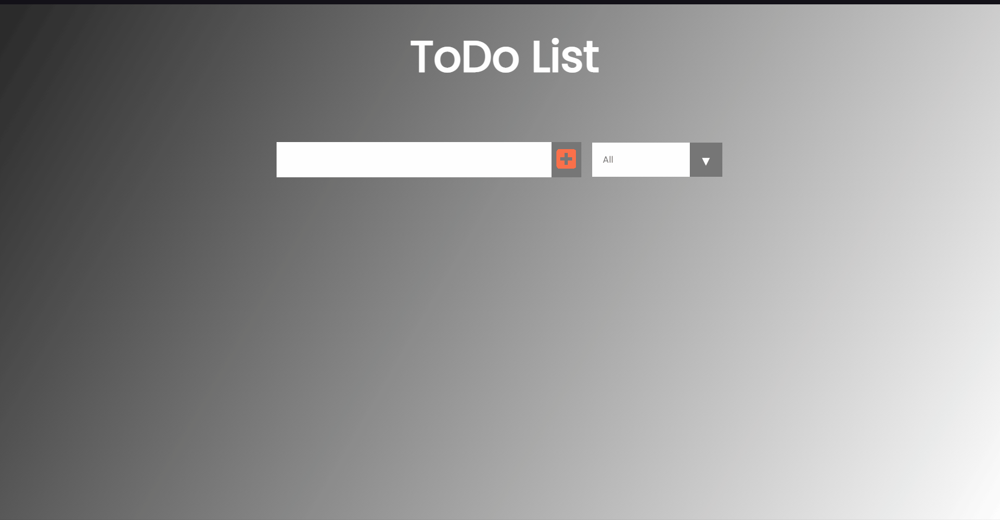

# ToDo List
> Project developed with the intuit of learning the bases of React. <br> Made with a youtube tutorial, [Build A Todo App With REACT](https://www.youtube.com/watch?v=pCA4qpQDZD8).

## Table of contents
* [General info](#general-info)
* [Demo](#demo)
* [Technologies](#technologies)
* [Code](#code)
* [Features](#features)
* [Status](#status)
* [Contact](#contact)

## General info
This project was made with the motivation of çearning new technologies, mainly to start a carrer in Frontend develpment.
The project is all made in React using mostly React Hooks, like `useState` and `useEffect`.

## Demo


## Technologies


## Code
This project uses different **React Hooks** to the code be more clean and clear to the developer that want to read it. It uses **React Hooks** instead of **props**, because it's a more clean programmation and more responsive. 

### useState
```react
const [inputText, setInputText] = useState("");
```
This constante is used to recive and store the text inputed by the user in the `Form` component.

```react
const [todo, setTodo] = useState([]);
```
This constante stores an array that recives 3 parameters. It recives an `id`, the `inputText` and a state `completed`.
> The `id` is generated by a random function, so that this nunber never repeat. <br> The `inputText` is the variable that the user input. This will be recived from the `<input type="text" />` in the `Form` component. <br> The `completed` is a boolean used to filter the list when an `option` of the `select` is chose.

```react
const [status, setStatus] = useState('all');
```
This is used to store the state that the `select` is on. This is used to filter the ToDo's in the list created.

```react
const [filteredTodos, setFilteredTodos] = useState([]);
```
This constante is used to store the ToDo's with a `completed` or an `uncompleted` state. Is used to modified the list of ToDo's to print just the list with the `status` that is selected. 

### useEffect


## Features
The application different functions, mainly: 
* Insert text and create a `div` with the text inputed.
* Filter the list of ToDo's with a `select`.
* Mark the list of ToDo's as completed or incompleted.
* Delete ToDo's that are inputed by the user.
* Save all the ToDo's that the user create or modified in a **JSON** file.


## Status
Project is: _finished_.


## Contact
<a href="https://www.linkedin.com/in/tiagojosejesus/"></a>

<a href="https://twitter.com/tiagojosejesus"></a>
  
<a href="mailto:tiagojosepjesus@gmail.com"></a>
